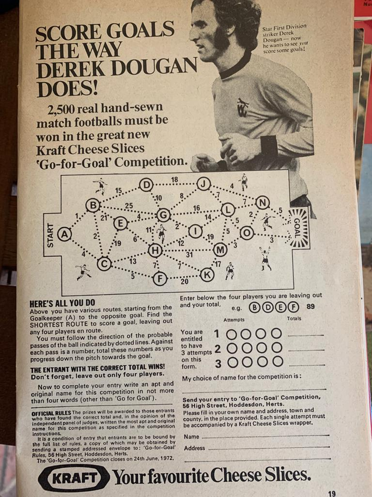

# Kraftwerk

In 1972, Kraft ran a competition based on football, with signed footballs as the prizes. You are given a graph of players (nodes) with allowed passes between the players (bidirectional edges) labelled with the cost of the pass. The graph has more than 11 players (15 in the one I've seen).

Your job is to pick 11 players from the possibilities, and find a path from the starting point to the opposing goal with the minimal cost but which involves all 11 players.

This can be seen as a 15 choose 11 combination problem (1365 possible choices of team) followed by a slight variant on the classic travelling salesman problem. (A variant, because the classic problem is circular, and there are edges between all nodes.)

## Brute force solutions

The files football.py and the equivalent football.rs are attempts to solve the travelling salesman problem by brute force. These take too long to run (>24 hours on my laptop).

puzzle.py is an attempt to solve the whole problem by brute force. This also takes too long (>> 24 hours on my laptop)

## Heuristic solutions

categoriser.rs contains a solver that works using the following algorithm, which is in two parts: first step is to find the shortest path from start (A) to goal; second step is to try to insert players one at a time into this path until we have used 11.

### First step (categoriser)

This method is I think guaranteed to find the optimal route from the start to the goal. It runs in a fraction of a second on my laptop.

Try all possible paths from point A, recording for each player the shortest distance to that player from point A. If you get to a player with a shorter distance than before, record the new shortest distance (and the path to get there) and keep walking. If not, stop walking and try another path. Eventually, you've tried all the paths, and you know the shortest path from A to any point on the field. 

The shortest distance given this algorithm to the goal is: ABCFHEGJNOx, distance 42, number of players 10
unused players {'M', 'D', 'L', 'I', 'K'}.

### Second step (inserter)

Try each of the unused players in turn, and try to insert them into the path at every possible point (e.g. try to insert player D into ABCFHEGJNOx -- ADBCFHEGJNOx, ABDCFHEGJNOx, ...). Only some of the points are legal in terms of allowing passes. Find the shortest extra distance for the legal moves, trying all the unused players, then replace the path with the one that uses this player. Now repeat until you've used all but four players.

The shortest distance given this algorithm is -- shortest route using 11 players is: ABCFHEGLJNOx, distance 52

### Second step (spur approach)

I added a new method to the second step, allowing the player to be optionally inserted on a spur. For example, insert player D into ABCFHEGJNOx -- ADABCFHEGJNOx, ABDBCFHEGJNOx, ...). As before, only some possibilities are legal. 

The shortest distance given a combination of the two possible second steps is -- shortest route using 11 players is: ABCFHEIGGJNOx, distance 46.
